# WQ Vision – AI-Powered Water Quality Testing Kit  

## 📌 Project Overview  
**WQ Vision** is an innovative **AI-powered water quality testing system** developed under the **SRM Institute of Science and Technology (SRMIST)**.  
It integrates **embedded hardware, IoT, and machine learning** to detect critical water parameters from **colorimetric test strips**.  

The system is designed to be:  
- Affordable  
- Portable  
- Easy to use in the field  
- Accurate for community water quality monitoring  

By combining **ESP32-CAM based image capture**, a **custom computer vision pipeline**, and a **FastAPI-powered web dashboard**, WQ Vision provides **real-time contaminant detection** and **safety classification**.  

---

## ❓ Problem Statement  
Access to clean and safe drinking water remains a critical issue. Conventional laboratory testing is:  
- Time-consuming  
- Expensive  
- Requires specialized equipment  

**WQ Vision** solves this by offering a **low-cost, portable testing kit** that leverages **AI and IoT** for **on-the-spot water quality analysis**.  

---

## ⚙️ System Features  

### 🔹 Prototype Hardware  
- **ESP32-CAM with antenna** → Captures strip images & transmits wirelessly  
- **16×2 LCD Display** → Displays test results instantly  
- **Lithium-ion Battery with Cooling Fan** → Ensures stable, standalone operation  
- **Compact Packaging** → Portable and user-friendly  

#### 📷 Prototype Images  
| Prototype (External) | Internal View | Close-up (LCD + Modules) | Full Setup |
|----------------------|---------------|---------------------------|------------|
| 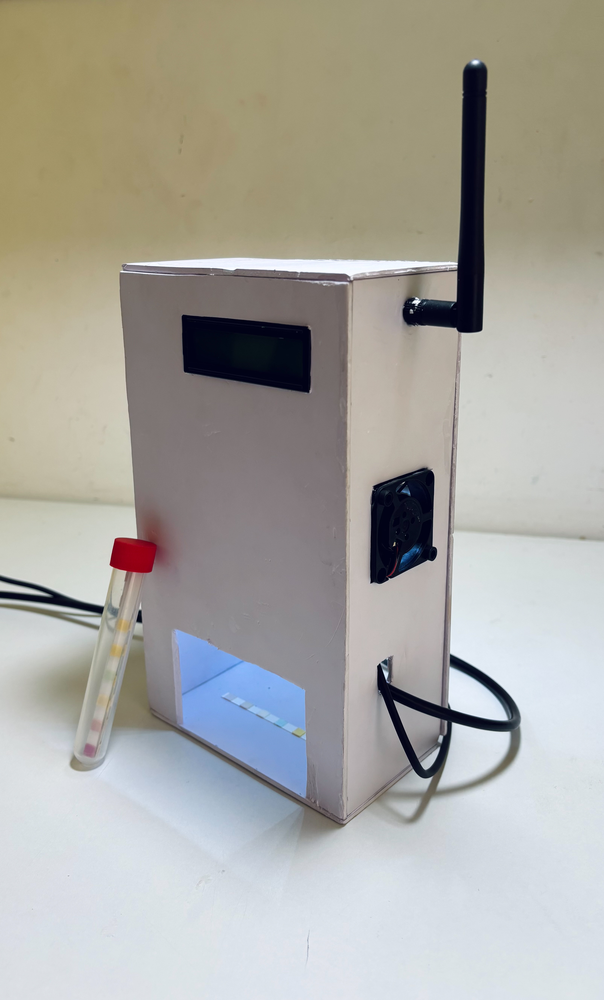 | 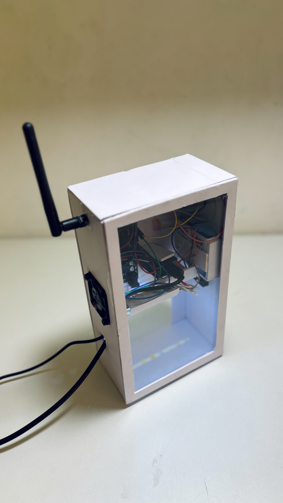 | 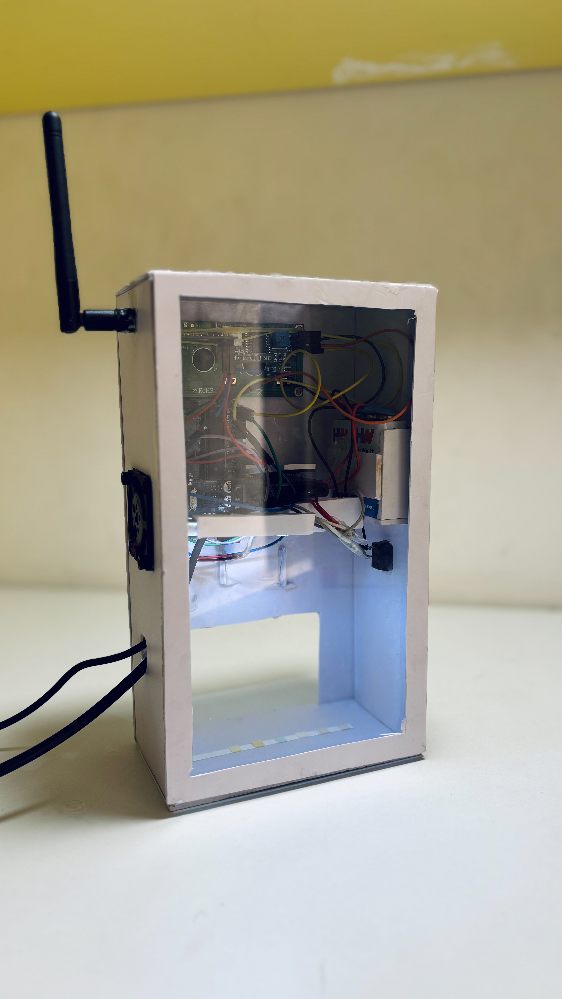 | 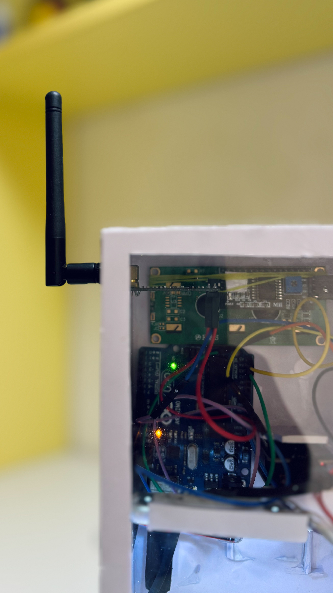 |

---

### 🤖 AI-Driven Analysis  
- Captures strip images using ESP32-CAM  
- Processes them through a **custom-trained AI model**  
- Detects and quantifies **six key parameters**:  
  - Nitrite  
  - Nitrate  
  - Chlorine  
  - Total Hardness  
  - Carbonate  
  - pH  
- Classifies results into **four safety categories**:  
  - ✅ Safe  
  - ⚠️ Confidence  
  - ⚡ Caution  
  - 🚨 Danger  

---

### 🌐 Web Dashboard (FastAPI + Lightweight Frontend)  
- Upload water strip images  
- View **real-time ppm values** with AI inference  
- Displays safety guidance and health impact commentary  
- Clean, minimal interface for fast assessment  

#### 🖼️ Dashboard Screenshots  
| Upload Page | Results View | PPM Scale | Prediction Details | Final Report |
|-------------|-------------|-----------|--------------------|--------------|
| 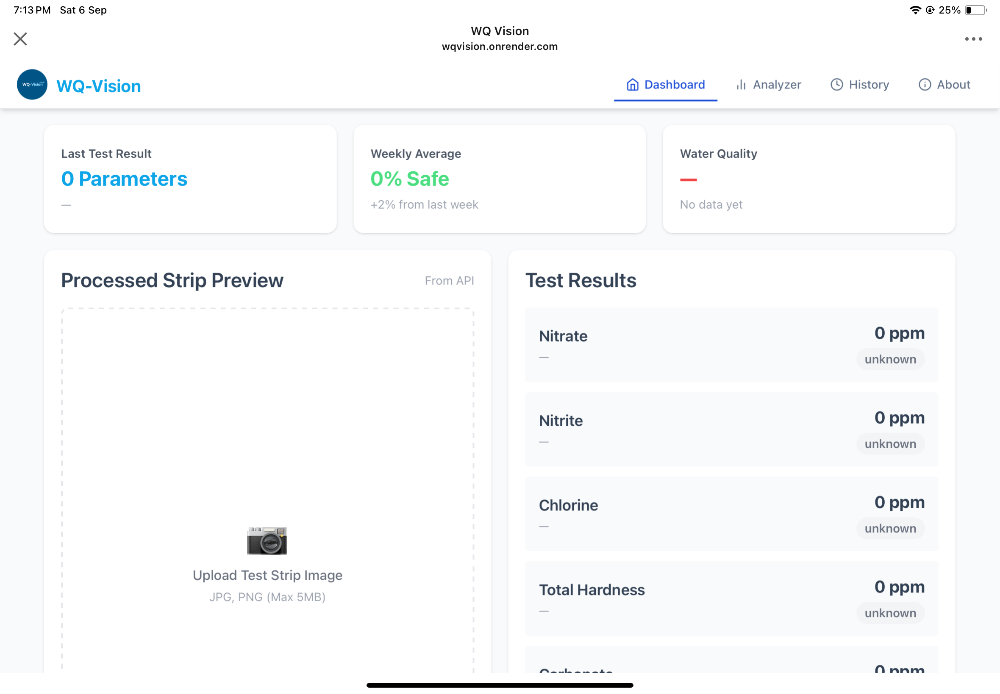 | 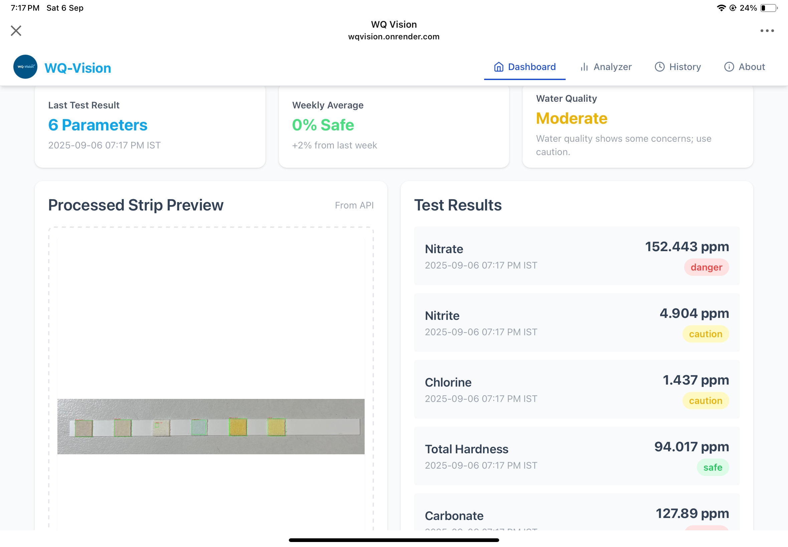 | 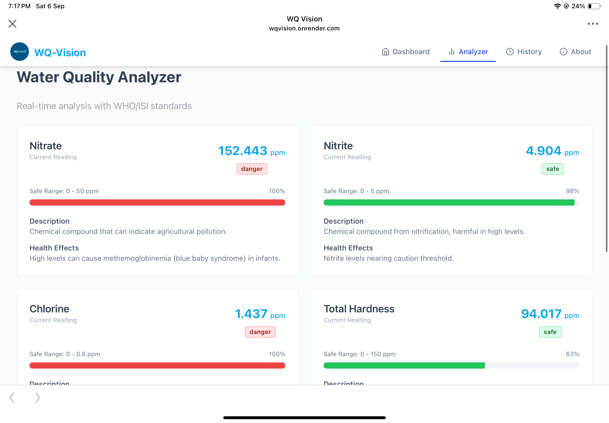 | 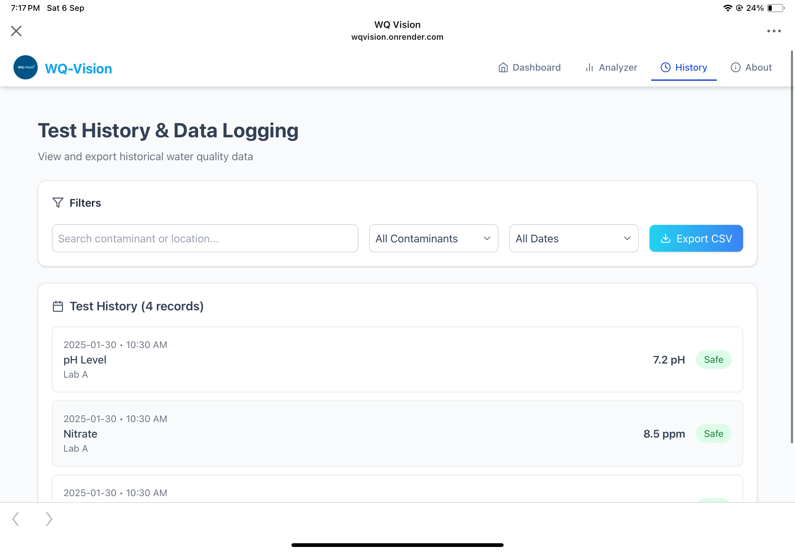 | 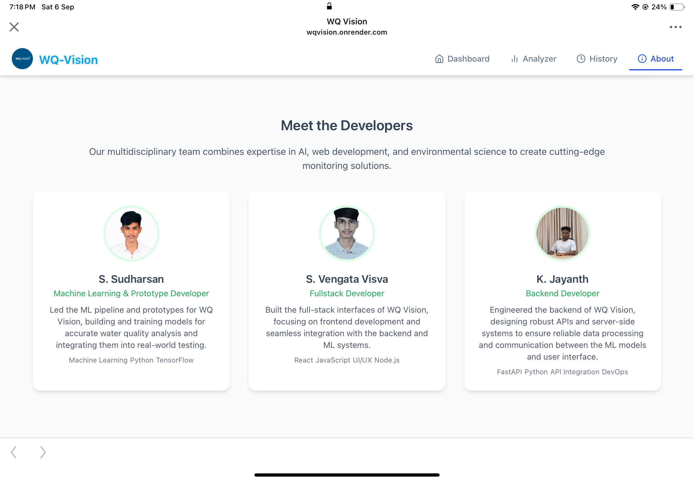 |

---

## 🏆 Achievements & Recognition  

- 🥇 **1st Place Winner** at **Protothon 1.0 (SRM IST)** 🏅  
- Recognized for **practicality, technical innovation, and social impact**  

#### 📸 Event Highlights  
| Award Certificate | Team Recognition |
|-------------------|------------------|
| 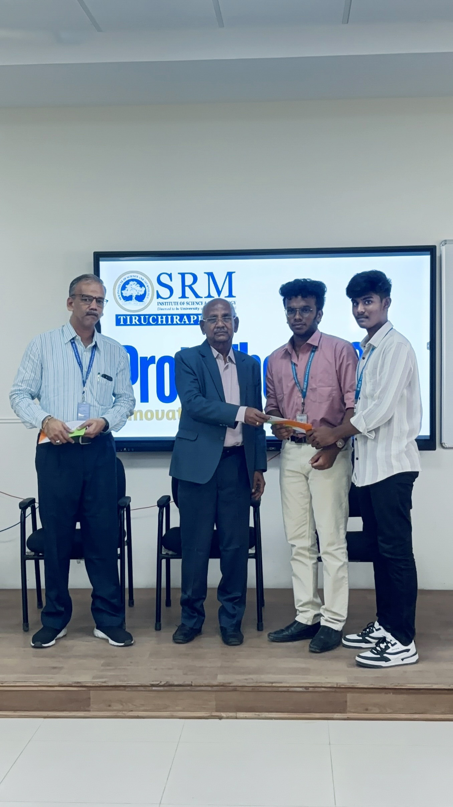 | 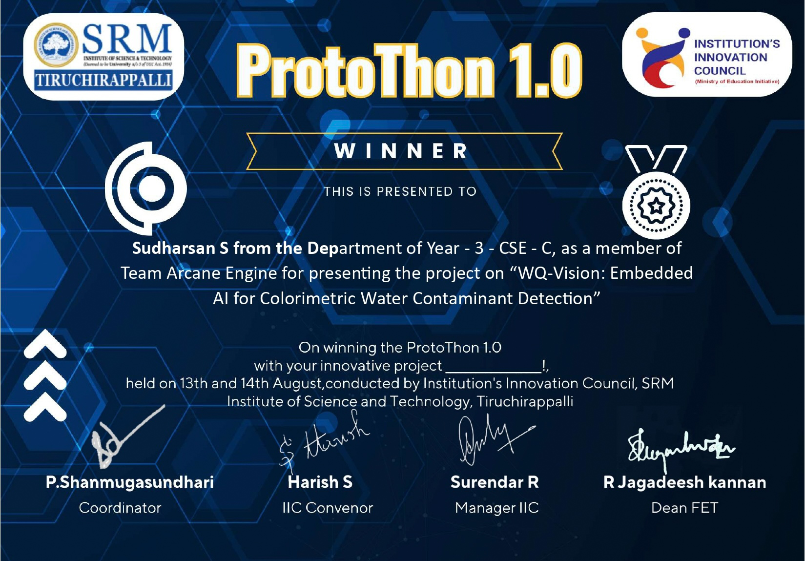 |

---

## 🏗️ System Architecture  

1. **Image Capture (ESP32-CAM)**  
   → Test strip photo taken and transmitted  

2. **AI Inference (Computer Vision Model)**  
   → Extracts color features and predicts ppm levels  

3. **Backend Processing (FastAPI)**  
   → Handles requests, runs inference, sends data  

4. **Output Delivery**  
   - Results displayed on **LCD hardware module**  
   - Results available on **Web Dashboard**  

---

## 📊 Tech Stack  

| Component          | Tools / Frameworks |
|--------------------|---------------------|
| **Embedded Hardware** | ESP32-CAM, LCD, Battery, Fan |
| **AI Model** | Custom Computer Vision Pipeline |
| **Backend API** | Python, FastAPI |
| **Frontend Dashboard** | HTML, CSS, JavaScript |
| **Deployment** | Local Server / Cloud |
| **IoT Integration** | Wireless Data Transmission |

---

## 🚀 Future Scope  

- Extend detection to **heavy metals** and **microbial contaminants**  
- Develop a **mobile application** for wider accessibility  
- Enable **cloud backend analytics** for long-term water monitoring  
- Adaptive calibration for **different geographical water standards**  

---

## 🙌 Acknowledgements  

Developed under the guidance of faculty at **SRM Institute of Science and Technology (SRMIST)**.  
Special thanks to mentors, peers, and the judging panel at **Protothon 1.0**.  

---

## ✨ Key Takeaway  

> *“WQ Vision demonstrates how AI, IoT, and embedded hardware can revolutionize water quality testing, making clean water insights accessible, affordable, and intelligent.”*
