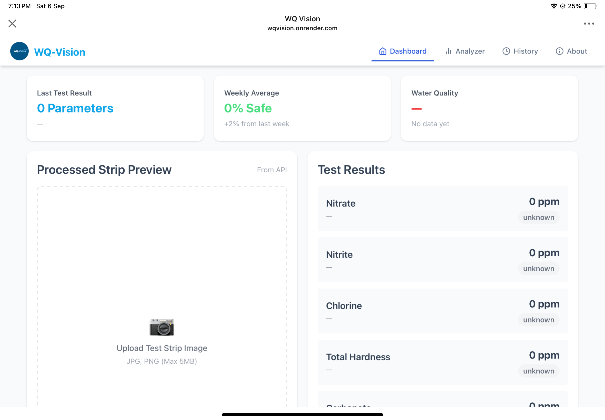
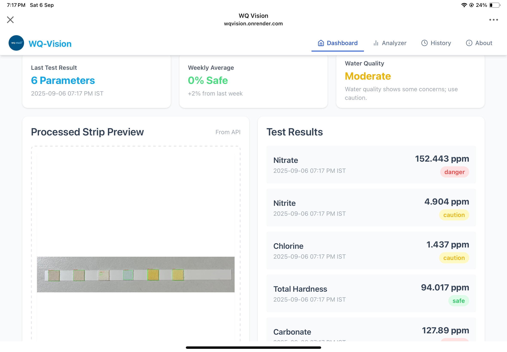
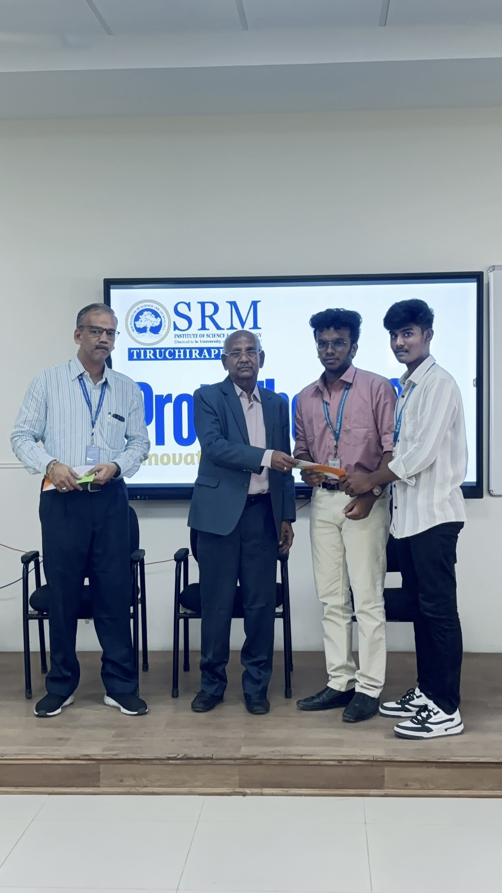
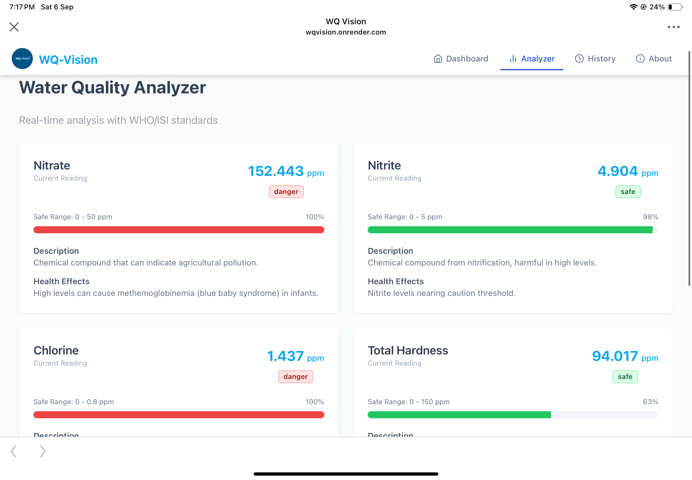
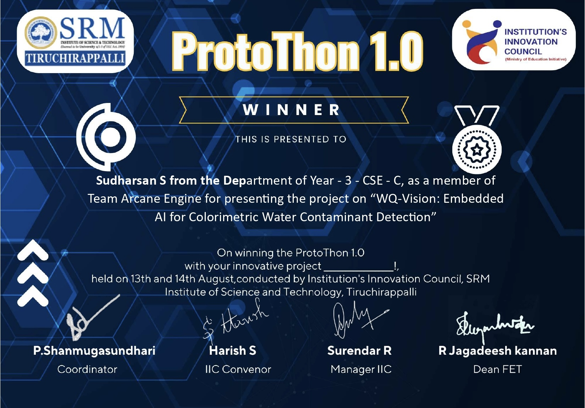
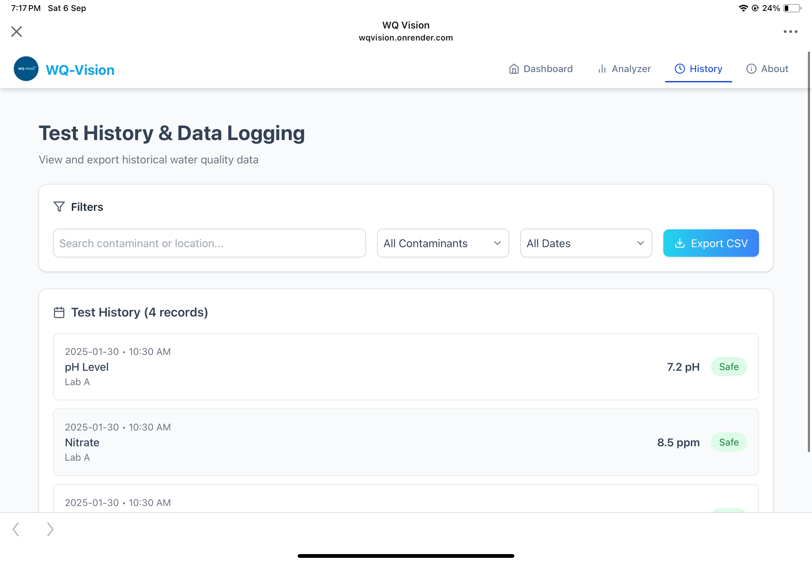
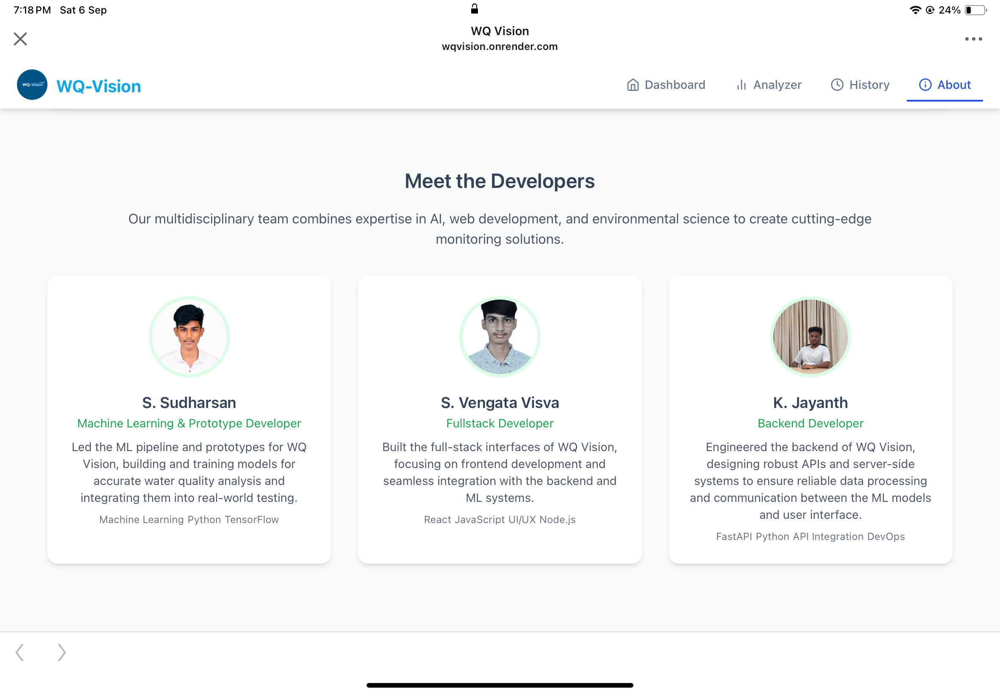

# WQ Vision – AI-Powered Water Quality Testing Kit

---

## 🖼️ Prototype & System  

| Hardware Prototype | Internal View | Close-Up |
|--------------------|---------------|----------|
|  |  |  |

---

## 🤖 AI-Driven Analysis  

The system captures images of **colorimetric strips** via ESP32-CAM and processes them using a **custom AI model**.  

| AI Workflow | Model Flow |
|-------------|------------|
|  |  |

---

## 🌐 Web Dashboard  

The web application (FastAPI + lightweight frontend) allows users to upload strip images and view **real-time predictions**.  

| Dashboard UI |
|--------------|
|  |

---

## 🏆 Achievements & Recognition  

This project won **1st place at Protothon 1.0 (SRM IST)** 🏅.  

| Event Certificate | Achievement | Judge Panel |
|-------------------|-------------|-------------|
|  |  |  |

Additional Recognition:  

---

## 📌 Project Overview  

**WQ Vision** is an innovative **AI-powered water quality testing system** developed under **SRM Institute of Science and Technology (SRMIST)**.  
It combines **computer vision**, **embedded systems**, and **machine learning** to detect key water contaminants:  

- Nitrite  
- Nitrate  
- Chlorine  
- Total Hardness  
- Carbonate  
- pH  

---

## ⚙️ Features  

### Prototype Hardware  
- 16×2 LCD Display  
- ESP32-CAM + Antenna  
- Lithium-ion Battery + Cooling Fan  
- Compact & Portable  

### AI-Driven Analysis  
- Custom ML Model for Strip Detection  
- Confidence Categories: `Safe | Confidence | Caution | Danger`  

### Web Dashboard  
- Upload Strip Images  
- PPM Scale Results + Health Guidance  

### IoT + AI Fusion  
- Real-time data transmission  
- Embedded + Web + AI pipeline  

---

## 📊 Tech Stack  

| Component          | Tools / Frameworks |
|--------------------|---------------------|
| Embedded Hardware  | ESP32-CAM, LCD, Battery, Fan |
| AI Model           | Custom Computer Vision Pipeline |
| Backend API        | Python, FastAPI |
| Frontend Dashboard | HTML, CSS, JS |
| Deployment         | Local Server / Cloud |
| IoT Integration    | Wireless Data Transmission |

---

## 🚀 Future Scope  
- Expansion to detect **heavy metals & microbial presence**  
- Mobile app integration  
- Cloud backend for analytics  
- Adaptive calibration for local water standards  

---

## 🙌 Acknowledgements  

Developed at **SRM Institute of Science and Technology (SRMIST)**.  
🏅 Awarded **1st place at Protothon 1.0** for innovation and real-world impact.  

---

*“WQ Vision: Bringing intelligent, accessible water quality insights to the field—one strip at a time.”*
